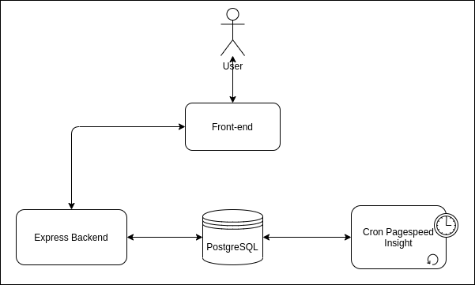

# Pagespeed-Insight

## Using Docker

First you will need to have docker installed:

#### Install Docker and Docker-compose:

```bash
curl -sSL https://get.docker.com/ | sh
```

```bash
curl -L "https://github.com/docker/compose/releases/download/1.25.0/docker-compose-$(uname -s)-$(uname -m)" -o docker-compose
chmod +x docker-compose
sudo mv docker-compose /usr/local/bin/docker-compose
```

Use `docker` and `docker-compose` without `sudo`:

```bash
sudo usermod -aG docker $USER
```

You will need to logout and login back to apply permissions on user

#### Start Project

First you will have to edit back-insight/.env file with google api key (or add a line in docker-compose.yml in back-insight env variables with GOOGLE_API_KEY="key")

Then build and run docker containers using this command
```bash
docker-compose build && docker-compose up -d
```

Now you can create tables using :

```bash
cd back-insight && docker-compose exec back-insight npm run migrate
```

Then wait some minutes ( the cron is running each minute to fetch data on pagespeed Insight )

The front is accessible on [http://localhost:3000/](http://localhost:3000/)

## Architecture
